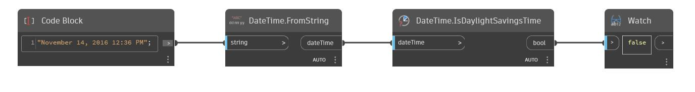

## Informacje szczegółowe
Węzeł IsDaylightSavingsTime zwraca wartość logiczną na podstawie tego, czy wartość dateTime mieści się w przedziale czasu letniego. W poniższym przykładzie wartość dateTime wskazująca 14 listopada 2016 r, 12:36 zwraca wartość fałsz (false).
___
## Plik przykładowy

