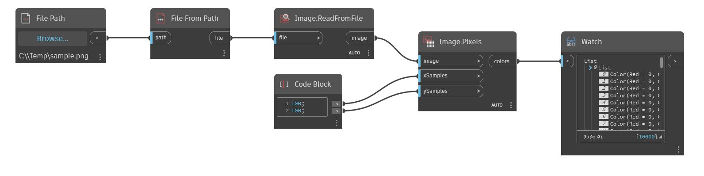

## Informacje szczegółowe
Węzeł Pixels zwraca listę kolorów (colors) na podstawie obrazu wejściowego w postaci dwuwymiarowej tablicy. Węzeł Pixels ma dwie dodatkowe pozycje wejściowe określające liczbę próbek x i y używanych do wyodrębniania pikseli. W poniższym przykładzie odczytujemy obraz za pomocą węzła ReadFromFile. Ten obraz jest następnie wprowadzany do węzła Pixels w celu wyodrębnienia kolorów pikseli.
___
## Plik przykładowy

