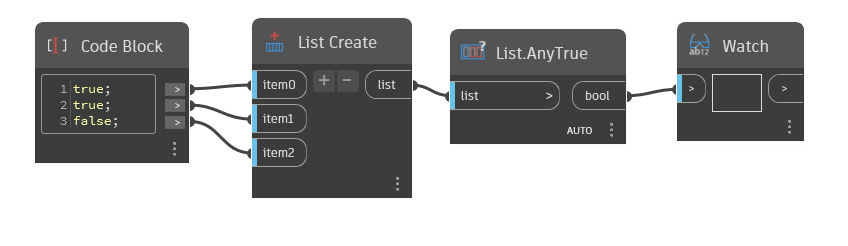

## Informacje szczegółowe
Węzeł `List.AnyTrue` zwraca wartość True (prawda), jeśli na danej liście (list) jest co najmniej jedna wartość logiczna True.

W poniższym przykładzie określamy za pomocą węzła `List.AnyTrue`, czy lista ma wartości True (prawda). Istnieją dwie wartości True, więc węzeł AnyTrue zwraca wartość True.
___
## Plik przykładowy

