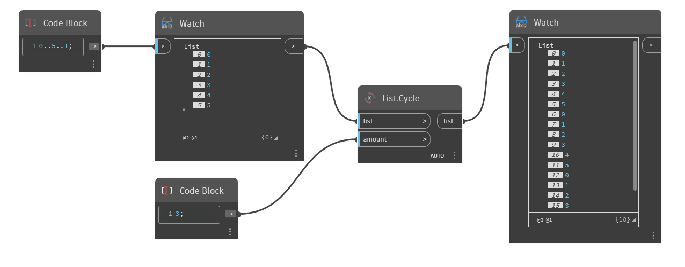

## Informacje szczegółowe
Węzeł `List.Cycle` pobiera listę wejściową (list) i zwraca nową listę (list) składającą się z listy wejściowej powtórzonej tyle razy, ile wskazano za pomocą danych wejściowych `amount`.

W poniższym przykładzie za pomocą węzła Code Block generujemy zakres liczb z przedziału od 0 do 5 z przyrostem 1. Następnie używamy węzła `List.Cycle` z wartością wejściową amount równą 3. Wynikiem jest lista zawierająca 18 elementów, składająca się z 3 cykli listy pierwotnej.
___
## Plik przykładowy

