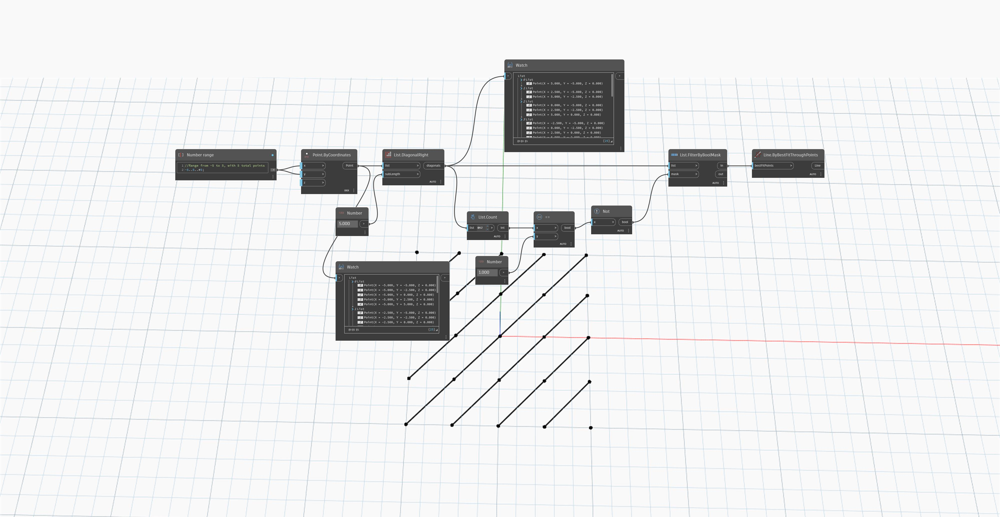

## Informacje szczegółowe
Węzeł `List.DiagonalRight` zwraca nową listę list elementów wzdłuż poszczególnych linii ukośnych w macierzy list od dolnej prawej strony do górnej lewej strony.

W poniższym przykładzie tworzymy siatkę punktów z przebiegającymi przez nie ukośnie liniami. Węzeł `List.DiagonalRight` zwraca listę punktów w kierunku ukośnym od dolnej prawej strony siatki do górnej lewej strony.

___
## Plik przykładowy

