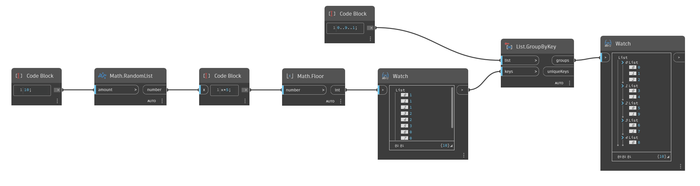

## Informacje szczegółowe
Węzeł `List.GroupByKey` grupuje elementy z listy wejściowej na podstawie listy kluczy. Lista kluczy powinna zawierać tę samą liczbę elementów co lista wejściowa. Elementy listy pierwotnej odpowiadające zgodnym kluczom zostają zgrupowane na liście wyjściowej.

W poniższym przykładzie używamy zakresu liczb z przedziału od 0 do 9 jako listy wejściowej. Generujemy również listę 10 liczb losowych z przedziału od 0 do 4, aby użyć ich jako kluczy. Węzeł `List.GroupByKey` generuje listę zagnieżdżoną elementów pogrupowanych według odpowiednich kluczy. Zwraca też listę niepowtarzalnych kluczy.
___
## Plik przykładowy

