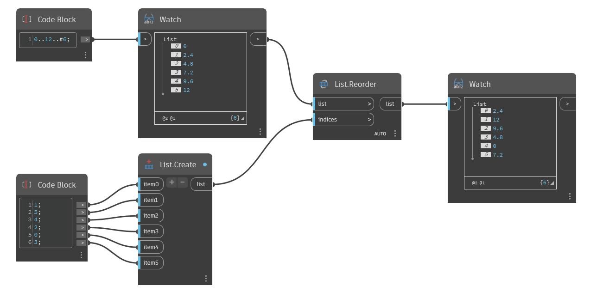

## Informacje szczegółowe
Węzeł `List.Reorder` zwraca nową listę ze zmienioną kolejnością elementów na podstawie listy indeksów.

W poniższym przykładzie zostaje utworzona nowa lista przez ręczną zmianę kolejności indeksów. Każdy indeks wejściowy powoduje przypisanie do elementu z listy pierwotnej nowego miejsca na liście. Na przykład pozycja item0 ma wartość 1, więc pierwsza pozycja na nowej liście to 2,4, która na liście pierwotnej miała indeks 1. Pozycja item1 ma wartość 5, więc druga pozycja na nowej liście to 12, która na liście pierwotnej miała indeks 5, itd.
___
## Plik przykładowy

