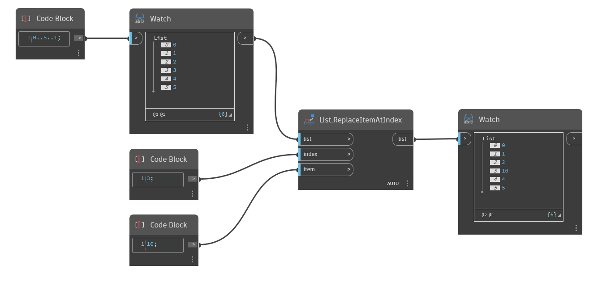

## Informacje szczegółowe
Węzeł `List.ReplaceItemAtIndex` zastępuje element na liście wejściowej o podanym indeksie.

W poniższym przykładzie zaczynamy od zakresu liczb od 0 do 5. Następnie za pomocą węzła `List.ReplaceItemAtIndex` zastępujemy element o indeksie 3 nowym elementem — w tym przypadku liczbą całkowitą (integer) 10.
___
## Plik przykładowy

