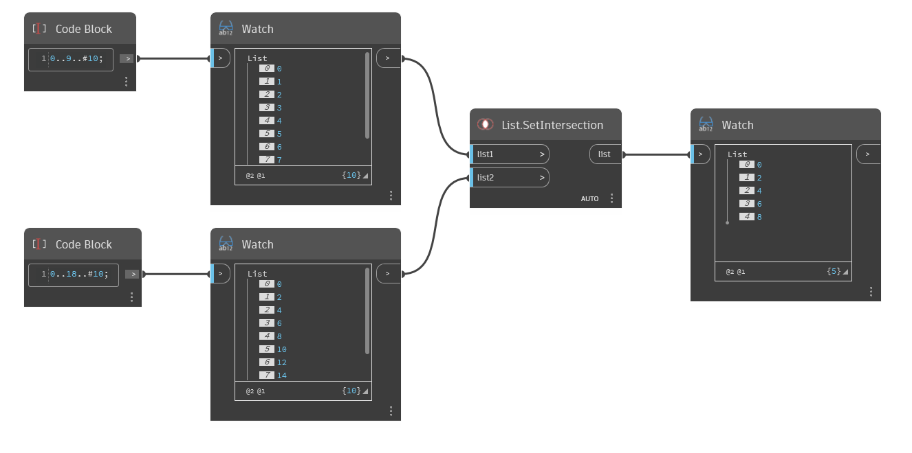

## Informacje szczegółowe
Węzeł `List.SetIntersection` zwraca nową listę, która zawiera tylko obiekty znajdujące się na obu listach wejściowych.

W poniższym przykładzie węzeł `List.SetIntersection` porównuje listę z wartościami od 0 do 9 z przyrostem 1 z listą z wartościami od 0 do 18 z przyrostem 2. Zwracane są liczby parzyste poniżej 10, ponieważ znajdują się na obu listach List1 i List2.
___
## Plik przykładowy

