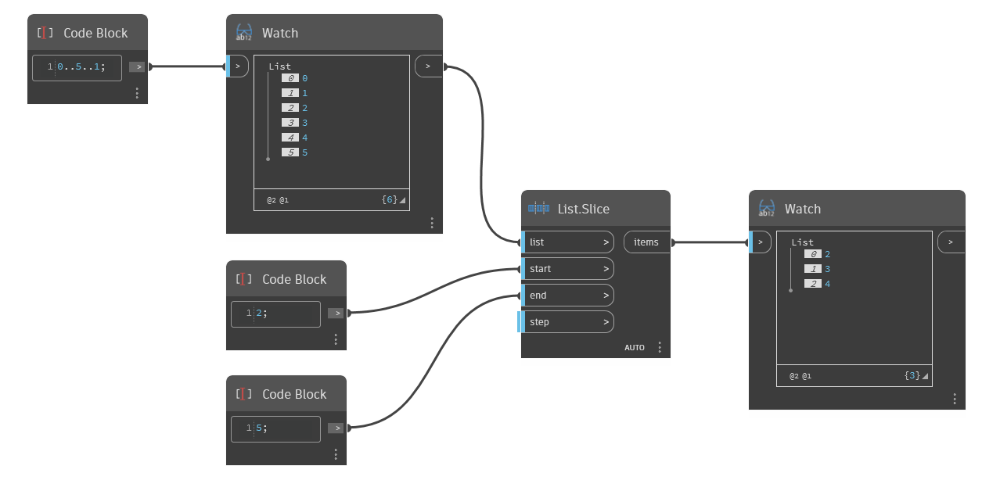

## Informacje szczegółowe
Węzeł `List.Slice` zwraca listę podrzędną z listy wejściowej (list) na podstawie podanego początku (start), końca (end) i kroku (step). Wartość wejściowa `start` określa indeks początkowy listy wyjściowej. Wartość wejściowa `end` określa jej indeks końcowy. Indeks ten nie jest uwzględniany na liście wyjściowej. Wartość wejściowa `step` określa liczbę indeksów oddzielających poszczególne elementy listy. Domyślnie jest to 1.

W poniższym przykładzie użycie indeksu początkowego (start) o wartości 2 i indeksu końcowego (end) o wartości 5 powoduje utworzenie nowej listy zawierającej elementy z indeksami 2, 3 i 4 z listy pierwotnej.
___
## Plik przykładowy

