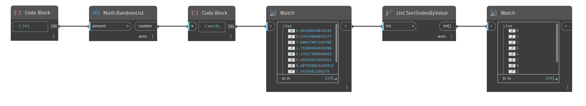

## Informacje szczegółowe
Węzeł `List.SortIndexByValue` zwraca listę indeksów posortowanych według wartości elementów w porządku rosnącym.

W poniższym przykładzie zostaje posortowana lista liczb losowych i nowa kolejność zostaje zwrócona jako wartości indeksu.
___
## Plik przykładowy

