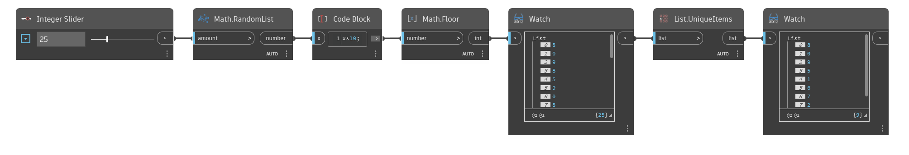

## Informacje szczegółowe
Węzeł `List.UniqueItems` usuwa wszystkie powielone elementy z listy wejściowej (list), tworząc nową listę, która zawiera tylko elementy występujące na liście pierwotnej tylko raz.

W poniższym przykładzie najpierw za pomocą węzła `Math.RandomList` generujemy listę liczb losowych z przedziału od 0 do 1. Następnie mnożymy je przez 10 i za pomocą operacji `Math.Floor` zwracamy listę losowych liczb całkowitych z przedziału od 0 do 9, z których wiele powtarza się wielokrotnie. Za pomocą węzła `List.UniqueItems` tworzymy listę, na której każda liczba całkowita występuje tylko raz. Kolejność listy wyjściowej zależy od pierwszego znalezionego wystąpienia elementu
___
## Plik przykładowy

