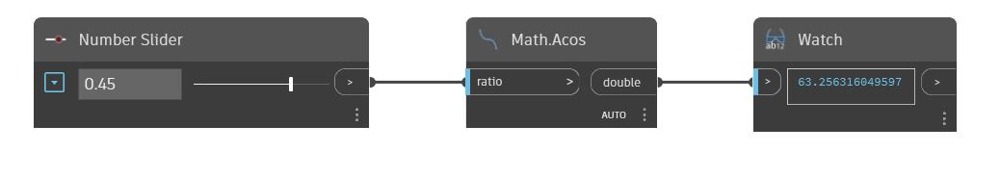

## Informacje szczegółowe
Węzeł Acos zwraca odwrotność funkcji cosinus, czyli arcus cosinus, dla liczby wejściowej z przedziału od -1 do 1. Ten kąt wyjściowy jest zwracany w stopniach. W poniższym przykładzie używamy suwaka Number Slider ustawionego na przedział od -1 do 1, aby sterować wartością wejściową węzła Acos.
___
## Plik przykładowy

