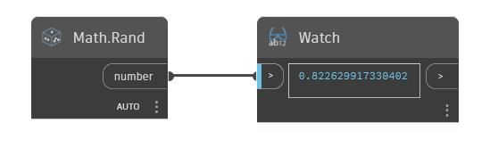

## Informacje szczegółowe
Węzeł Rand generuje liczbę losową z przedziału od 0 do 1. Każde wystąpienie węzła Rand powoduje utworzenie innej liczby losowej, ale liczba dla konkretnego wystąpienia pozostaje stała.
___
## Plik przykładowy

