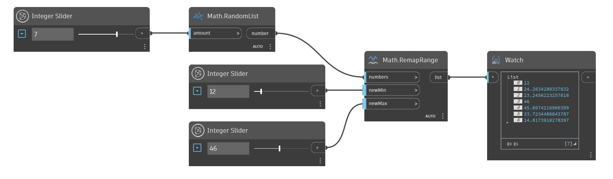

## Informacje szczegółowe
Węzeł RemapRange pobiera listę liczb (numbers) i tworzy skalowanie liniowe tych liczb w nowym określonym zakresie. Wartość minimalna listy pierwotnej jest odwzorowywana na pozycję wejściową newMin, a maksymalna — na pozycję wejściową newMax. Pozostałe liczby są skalowane w celu zachowania współczynnika rozkładu. W poniższym przykładzie używamy węzła RandomList do wygenerowania listy liczb do ponownego odwzorowania. Za pomocą dwóch suwaków Number Slider sterujemy nowymi wartościami minimalnymi i maksymalnymi listy wynikowej.
___
## Plik przykładowy

