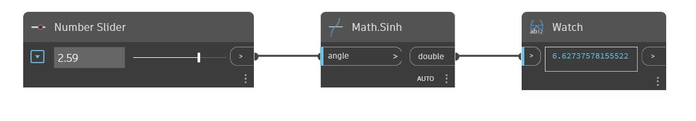

## Informacje szczegółowe
Węzeł Sinh zwraca sinus hiperboliczny kąta wejściowego (angle) w radianach. W poniższym przykładzie używamy suwaka Number Slider ustawionego na zakres od -6,28 do 6,28, aby sterować kątem wejściowym dla węzła Sinh.
___
## Plik przykładowy

