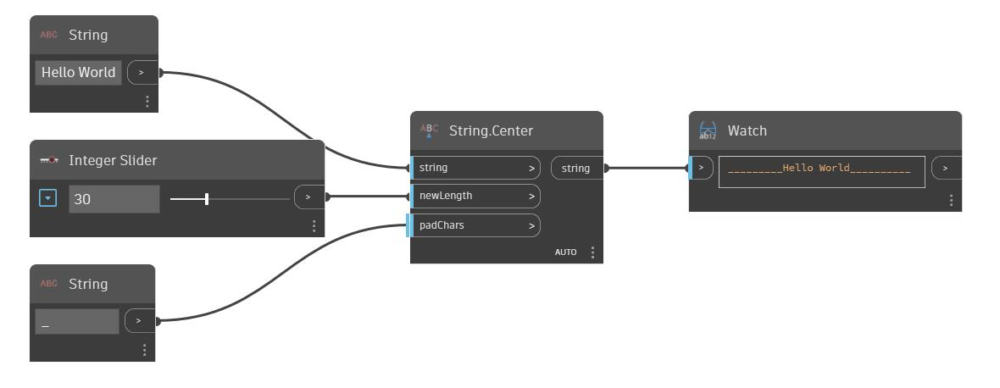

## Informacje szczegółowe
Węzeł Polygon Center znajduje środek danego wieloboku (polygon) na podstawie średniej wartości rogów. W przypadku wieloboków wklęsłych środek może leżeć poza wielobokiem. W poniższym przykładzie najpierw generujemy listę losowych kątów i promieni, które mają być danymi wejściowymi węzła Point By Cylindrical Coordinates. Sortując najpierw kąty, zapewniamy, że wynikowy wielobok będzie połączony w kolejności rosnących kątów, nie będzie więc sam się przecinać. Następnie za pomocą węzła Center wyznaczającego średnią punktów znajdujemy środek wieloboku.
___
## Plik przykładowy

