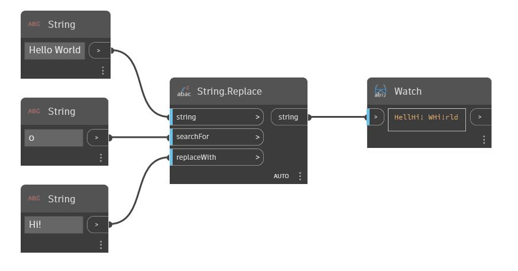

## Informacje szczegółowe
Węzeł Replace przeszukuje dany ciąg (string) pod kątem drugiego ciągu wejściowego. W razie znalezienia tego ciągu jest on zastępowany trzecim ciągiem wejściowym. Ten węzeł uwzględnia wielkość liter. W poniższym przykładzie zaczynamy od ciągu „Hello World”. Wyszukiwany jest ciąg „o”, a trzeci ciąg używany do zastępowania to „Hi!”. Ponieważ litera „o” występuje w ciągu pierwotnym dwa razy, jest zastępowana w obu wystąpieniach ciągiem „Hi!”.
___
## Plik przykładowy

