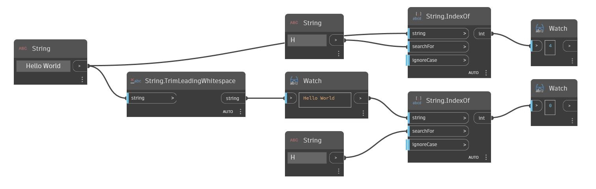

## Informacje szczegółowe
Węzeł TrimLeadingWhitespace usuwa odstępy na początku ciągu wejściowego (string). W poniższym przykładzie zaczynamy od ciągu „Hello World”, który zawiera kilka spacji wiodących i kończących. Za pomocą węzła TrimLeadingWhitespace możemy usunąć spacje na początku ciągu.
___
## Plik przykładowy

