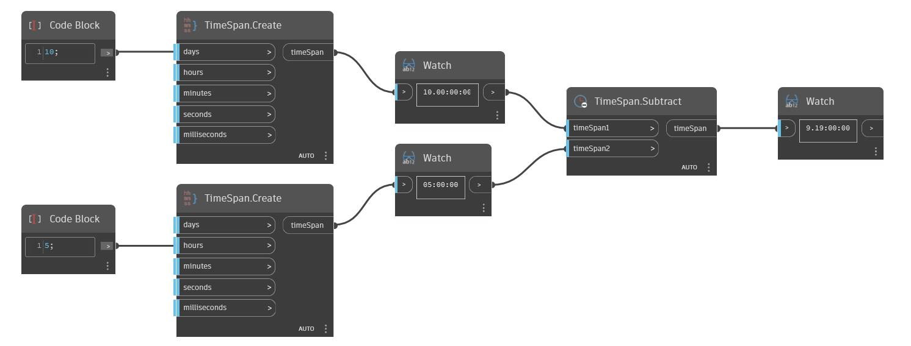

## Informacje szczegółowe
Węzeł Subtract zwraca wektor (Vector), który jest różnicą dwóch innych wektorów. W poniższym przykładzie odjęcie od wektora o współrzędnych (1,0,1) osi Z GUW powoduje utworzenie wektora o współrzędnych (1,0,0). Dostosowanie suwaka Vector Direction spowoduje zmianę wartości współrzędnych wektora i zwrócenie innego wektora w wyniku odejmowania. Wektory są reprezentowane za pomocą linii.
___
## Plik przykładowy

