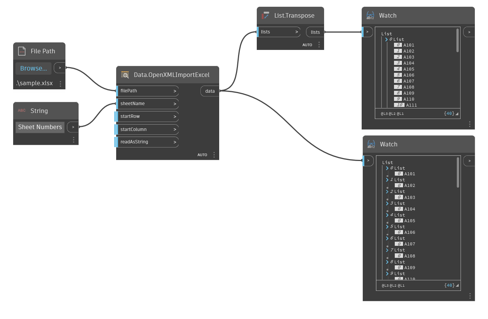

## Informacje szczegółowe
Węzeł Data.OpenXMLImportExcel odczytuje dane (data) w formacie programu Microsoft Excel przy użyciu standardu OpenXML. Ta wersja węzłów programu Excel nie wymaga, aby na komputerze był zainstalowany program Excel.
___
## Plik przykładowy

