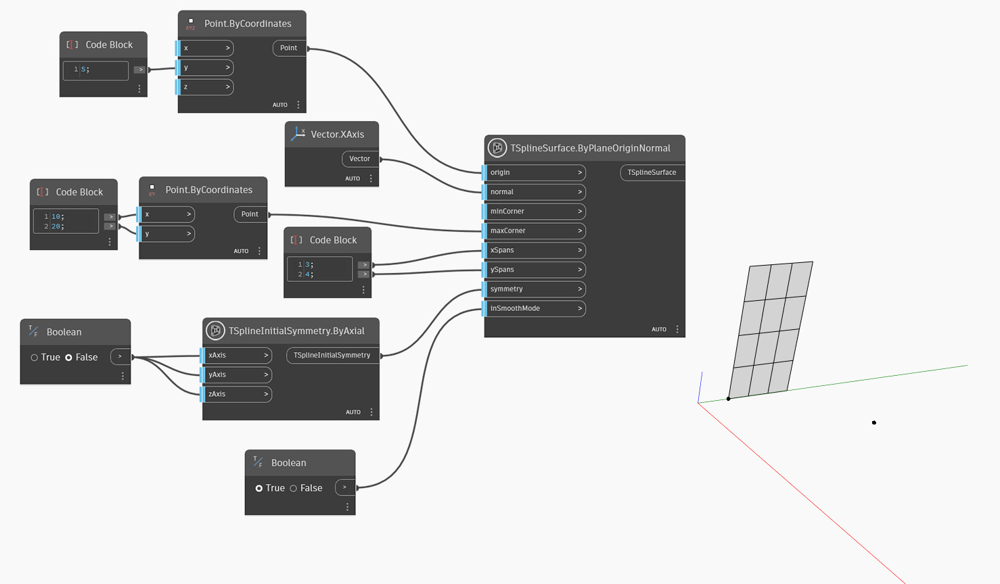

<!--- Autodesk.DesignScript.Geometry.TSpline.TSplineSurface.ByPlaneOriginNormal --->
<!--- DWYJGQGBW2MD57NAYFKR3UEMPTHASLR2IV2X2SUK3OKI35GCEVHQ --->
## In-Depth
Węzeł `TSplineSurface.ByPlaneOriginNormal` generuje powierzchnię płaszczyzny prymitywu T-splajn, używając punktu początkowego i wektora normalnego. Aby utworzyć płaszczyznę T-splajn, węzeł ten używa następujących danych wejściowych:
— `origin`: punkt definiujący początek płaszczyzny.
— `normal`: wektor określający kierunek wektora normalnego tworzonej płaszczyzny.
— `minCorner` i `maxCorner`: narożniki płaszczyzny reprezentowane jako punkty o wartościach X i Y (współrzędne Z zostaną zignorowane). Te narożniki reprezentują zakresy wyjściowej powierzchni T-splajn w przypadku przekształcenia jej na płaszczyznę XY. Punkty `minCorner` i `maxCorner` nie muszą pokrywać się z wierzchołkami narożnika w 3D. Na przykład gdy punkt `minCorner` ma ustawioną wartość (0,0), a punkt `maxCorner` — wartość (5,10), szerokość i długość płaszczyzny będą wynosić odpowiednio 5 i 10.
— `xSpans` i `ySpans`: liczba rozpiętości/podziałów szerokości i długości płaszczyzny
— `symmetry`: określa, czy geometria jest symetryczna względem osi X, Y i Z
— `inSmoothMode`: określa, czy wynikowa geometria będzie wyświetlana w trybie gładkim, czy w trybie ramki

W poniższym przykładzie zostaje utworzona powierzchnia płaska T-splajn przy użyciu podanego punktu początkowego i wektora normalnego, który jest wektorem osi X. Rozmiarem powierzchni sterują dwa punkty określane za pomocą danych wejściowych `minCorner` i `maxCorner`.

## Plik przykładowy

