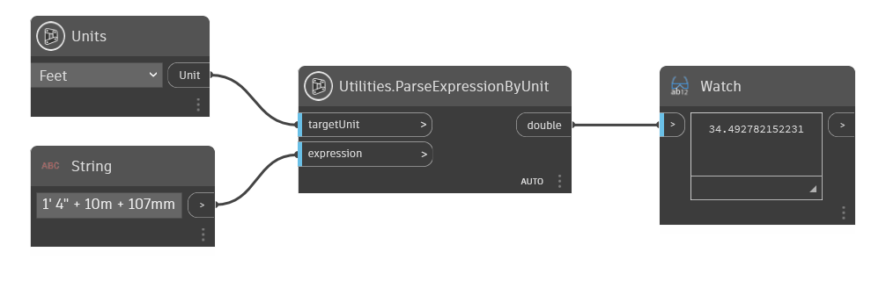

## Informacje szczegółowe
Węzeł Utilities.ParseExpressionByUnit odczytuje dany ciąg (z symbolami jednostek) i zwraca liczbę reprezentującą wartość wejściową z wybranymi jednostkami. Uwaga: można użyć dowolnej kombinacji typów jednostek, o ile są one wprowadzone z poprawnym symbolem.
___
## Plik przykładowy

