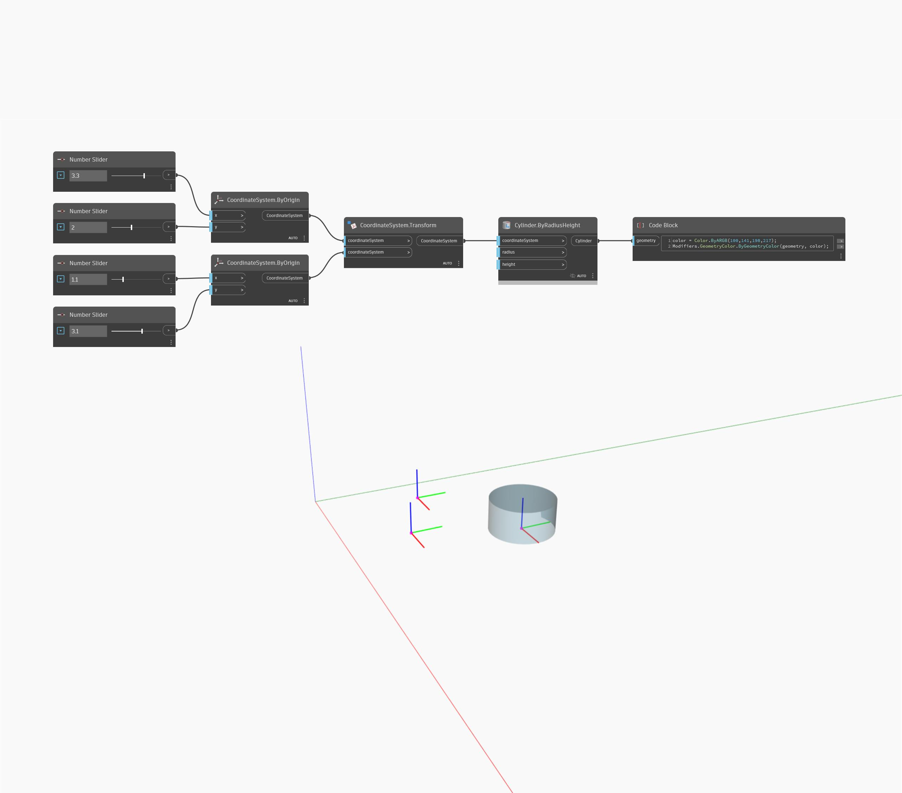

<!--- Autodesk.DesignScript.Geometry.Geometry.Transform(geometry, cs) --->
<!--- FYPDHZXND4VQKFSL7IXEWDONQWVSV7GLPRPS3VGIQTCEC2GVTC7A --->
## Informacje szczegółowe
Przekształca geometrię za pomocą danego przekształcenia CoordinateSystem.
___
## Plik przykładowy

