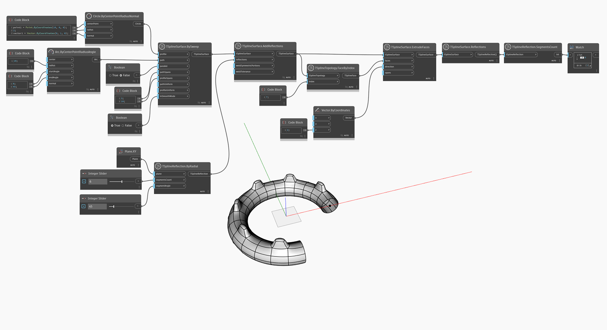

<!--- Autodesk.DesignScript.Geometry.TSpline.TSplineReflection.SegmentsCount --->
<!--- GLVHD43IRWFTZKY7UVDJ7PNERQN5Z3PWTMFYVJ537HCGJCHCQQAQ --->
## In-Depth
Węzeł `TSplineReflection.SegmentsCount` zwraca liczbę segmentów odbicia promieniowego. Jeśli odbicie TSplineReflection jest typu osiowego, węzeł zwraca wartość 0.

W poniższym przykładzie zostaje utworzona powierzchnia T-splajn z dodanymi odbiciami. Na dalszym etapie wykresu powierzchnia zostaje sprawdzona za pomocą węzła `TSplineSurface.Reflections`. Wynik (odbicie) zostaje następnie przekazany jako dane wejściowe do węzła `TSplineReflection.SegmentsCount`, aby zwrócić liczbę segmentów odbicia promieniowego, za pomocą którego utworzono powierzchnię T-splajn.

## Plik przykładowy

