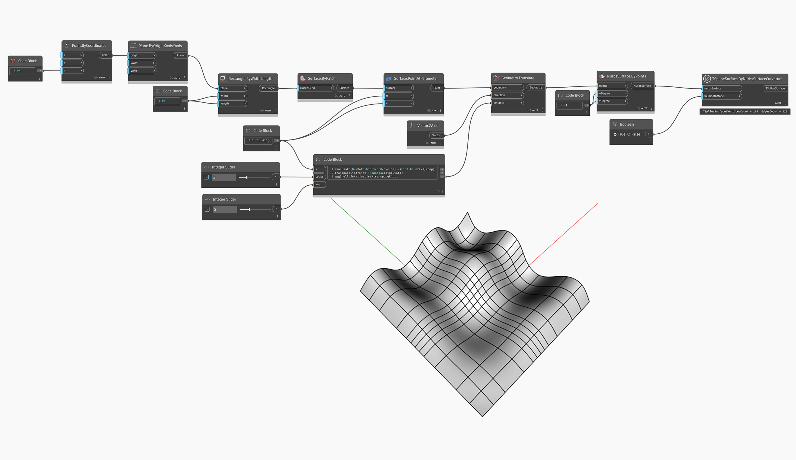

<!--- Autodesk.DesignScript.Geometry.TSpline.TSplineSurface.ByNurbsSurfaceCurvature --->
<!--- GO6D5UXWAXIC6JMDUDLIKMABU2I4XHLVLAL77BROSGFAFN7455KA --->
## Informacje szczegółowe
W poniższym przykładzie powierzchnia NURBS 3. stopnia zostaje przekształcona w powierzchnię T-splajn za pomocą węzła `TSplineSurface.ByNurbsSurfaceCurvature`. Liczba i położenia rozpiętości powierzchni T-splajn są wykrywane automatycznie w zależności od krzywizny.

## Plik przykładowy

