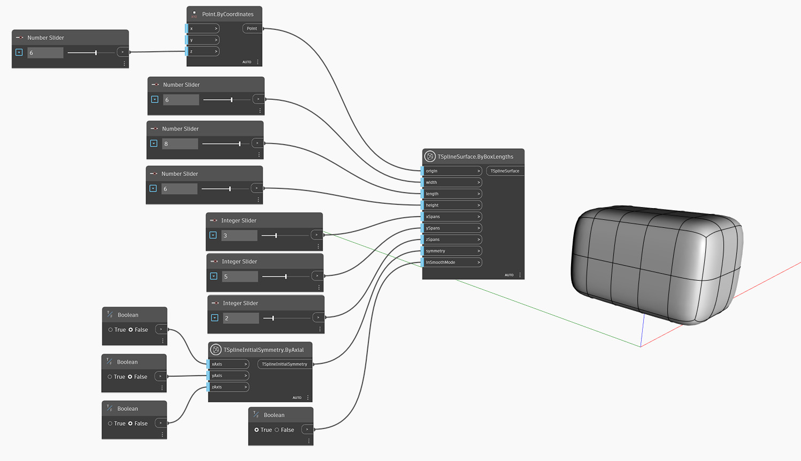

<!--- Autodesk.DesignScript.Geometry.TSpline.TSplineSurface.ByBoxLengths(origin, width, length, height, xSpans, ySpans, zSpans, symmetry, inSmoothMode) --->
<!--- HNVVP7HSR2IM5H5AFWWLLJBXSX2WTG5FEWESXLGORW2CL2CG7C4Q --->
## In-Depth
Węzeł `TSplineSurface.ByBoxLengths(origin, width, length, height, xSpans, ySpans, zSpans, symmetry, inSmoothMode)` tworzy powierzchnię prostopadłościanu T-splajn wyśrodkowaną w danym początku `origin`, z wymiarami zdefiniowanymi za pomocą pozycji danych wejściowych `width`, `length` oraz `height`, a także pewną liczbą rozpiętości X, Y i Z w każdym kierunku. Opcje symetrii można określić za pomocą pozycji danych wejściowych `symmetry`. Pozycja danych wejściowych `inSmoothMode` (wartość logiczna, Boolean) przełącza między podglądem w trybie gładkim i w trybie ramki.

## Plik przykładowy

