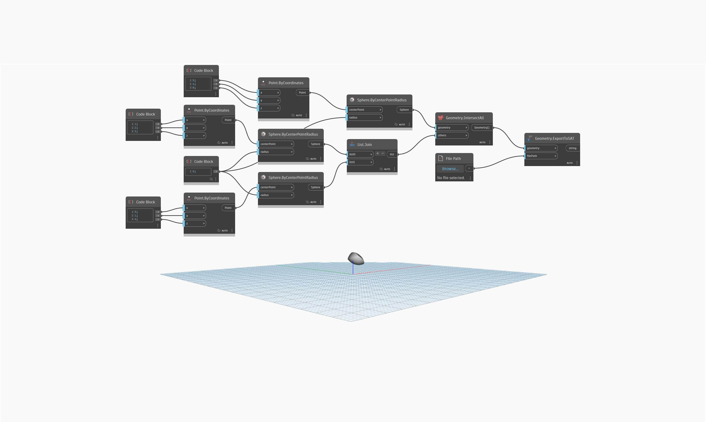

<!--- Autodesk.DesignScript.Geometry.Geometry.ExportToSAT(geometry, filePath) --->
<!--- JH36N5G6EIZEJ76U2VOWYIWXR6YQWP4IHRIMTPOZSNO2AH62Y7TA --->
## Informacje szczegółowe
Węzeł `Geometry.ExportToSAT` eksportuje geometrię z dodatku Dynamo do typu pliku SAT. Ten węzeł jest niemianowany — aby określić jednostkę, użyj węzła `ExportToSAT`.

W poniższym przykładzie powierzchnię PolySurface utworzoną z przecięcia trzech sfer można wyeksportować do pliku SAT po wybraniu ścieżki pliku.

___
## Plik przykładowy

