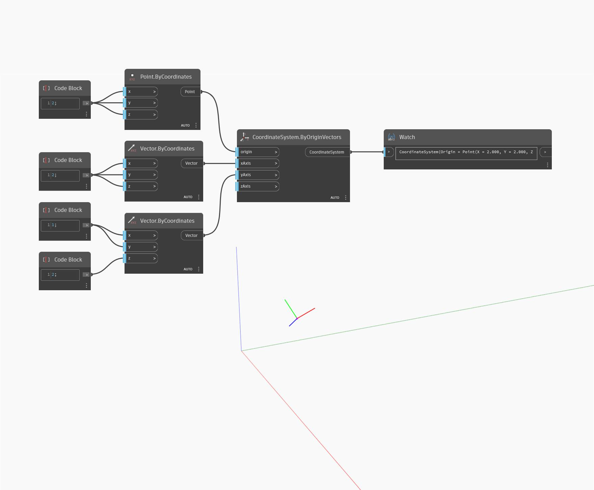

<!--- Autodesk.DesignScript.Geometry.CoordinateSystem.ByOriginVectors(origin, xAxis, yAxis, zAxis) --->
<!--- KLFVJ5DI7APVNODARMSE3JM5C27DG62OXUUQRS3HCDTZYO6IBOZA --->
## Informacje szczegółowe
Węzeł `CoordinateSystem.ByOriginVectors (origin, xAxis, yAxis, zAxis)` zwraca nowy układ CoordinateSystem o wejściowym punkcie początkowym (origin) i z wejściowymi osiami X, Y i Z.

W poniższym przykładzie układ CoordinateSystem zostaje umieszczony w początku z nowymi wektorami dla osi X, Y i Z. Wynikiem jest układ CoordinateSystem obrócony względem pierwotnego układu CoordinateSystem.

___
## Plik przykładowy

