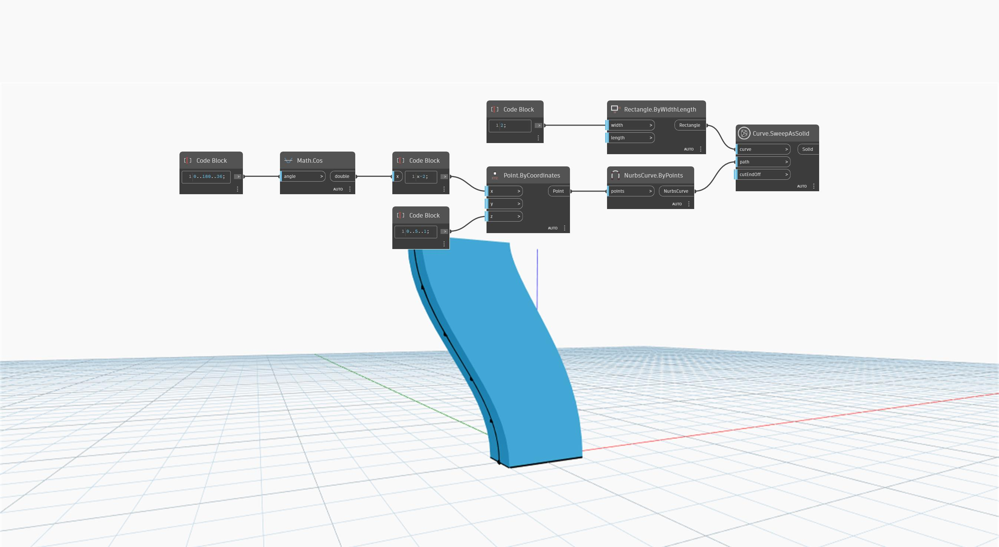

<!--- Autodesk.DesignScript.Geometry.Curve.SweepAsSolid(curve, path, cutEndOff) --->
<!--- LUVHU25JWECNEBKIBZFH6N5EUAM42XM3BSEOTMCI3TQDNS5EKLXA --->
## Informacje szczegółowe
Węzeł `Curve.SweepAsSolid` tworzy bryłę przez przeciągnięcie wejściowej krzywej o profilu zamkniętym wzdłuż określonej ścieżki.

W poniższym przykładzie jako bazowej krzywej profilu używamy prostokąta. Ścieżka zostaje utworzona za pomocą funkcji cosinus z sekwencją kątów różnicujących współrzędne x zestawu punktów. Tych punktów używamy jako danych wejściowych węzła `NurbsCurve.ByPoints`. Następnie za pomocą węzła `Curve.SweepAsSolid` tworzymy bryłę przez przeciągnięcie prostokąta wzdłuż utworzonej krzywej cosinusoidalnej.
___
## Plik przykładowy

