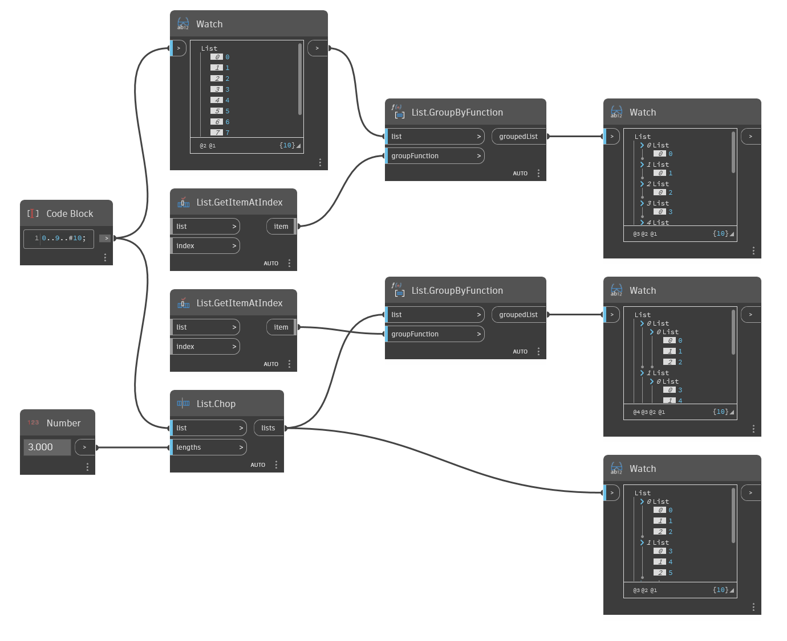

## Informacje szczegółowe
Węzeł `List.GroupByFunction` zwraca nową listę pogrupowaną według funkcji.

Pozycja danych wejściowych `groupFunction` wymaga węzła w stanie funkcji (tj. zwracającego funkcję). Oznacza to, że co najmniej jedno z wejść węzła nie jest połączone. Dodatek Dynamo uruchamia funkcję węzła na każdym elemencie z listy wejściowej węzła `List.GroupByFunction` w celu użycia danych wyjściowych jako mechanizmu grupowania.

W poniższym przykładzie dwie różne listy zostają pogrupowane za pomocą węzła `List.GetItemAtIndex` używanego jako funkcji. Ta funkcja tworzy grupy (nową listę) z każdego indeksu najwyższego poziomu.
___
## Plik przykładowy

