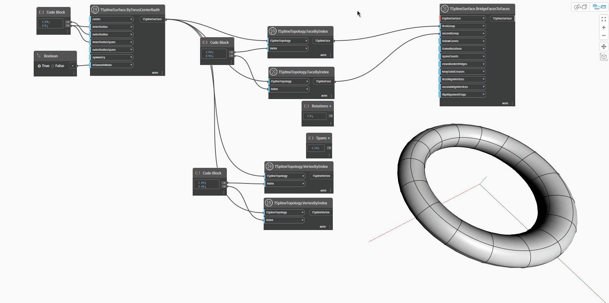

<!--- Autodesk.DesignScript.Geometry.TSpline.TSplineSurface.BridgeFacesToFaces --->
<!--- MQJ667AXSQFCK2Z2B7G2MNL35OIFJYLSADFLGXFJUJCA27FCHVHQ --->
## Informacje szczegółowe
Węzeł `TSplineSurface.BridgeEdgesToFaces` łączy dwa zestawy powierzchni — z tej samej powierzchni lub z dwóch różnych powierzchni. Węzeł wymaga danych wejściowych opisanych poniżej. Pierwsze trzy pozycje danych wejściowych są wystarczające do wygenerowania mostu — pozostałe dane wejściowe są opcjonalne. Wynikowa powierzchnia jest elementem podrzędnym powierzchni, do której należy pierwsza grupa krawędzi.

W poniższym przykładzie za pomocą węzła `TSplineSurface.ByTorusCenterRadii` zostaje utworzona powierzchnia torusa. Dwie z jej powierzchni zostają wybrane i przekazane jako dane wejściowe do węzła `TSplineSurface.BridgeFacesToFaces` razem z powierzchnią torusa. Pozostałe dane ilustrują, jak można dodatkowo dostosować most:
- `followCurves`: (optional) a curve for the bridge to follow. In the absence of this input, the bridge follows a straight line
- `frameRotations`: (optional) number of rotations of the bridge extrusion that connects the chosen edges.
- `spansCounts`: (optional) number of spans/segments of the bridge extrusion that connects the chosen edges. If the number of spans is too low, certain options might not be available until it is increased.
— `cleanBorderBridges`:(opcjonalnie) usuwa mosty między mostami obramowania, aby zapobiec fałdowaniu.
— `keepSubdCreases`: (opcjonalnie) zachowuje fałdowania podziału na składowe topologii wejściowej, co skutkuje pofałdowaniem początku i końca mostu. Powierzchnia torusa nie ma pofałdowanych krawędzi, więc ta pozycja danych wejściowych nie wpływa na kształt.
— `firstAlignVertices` (opcjonalnie) i `secondAlignVertices`: dzięki określeniu przesuniętej pary wierzchołków most uzyskuje lekki obrót.
- `flipAlignFlags`: (optional) reverses the direction of vertices to align

## Plik przykładowy

