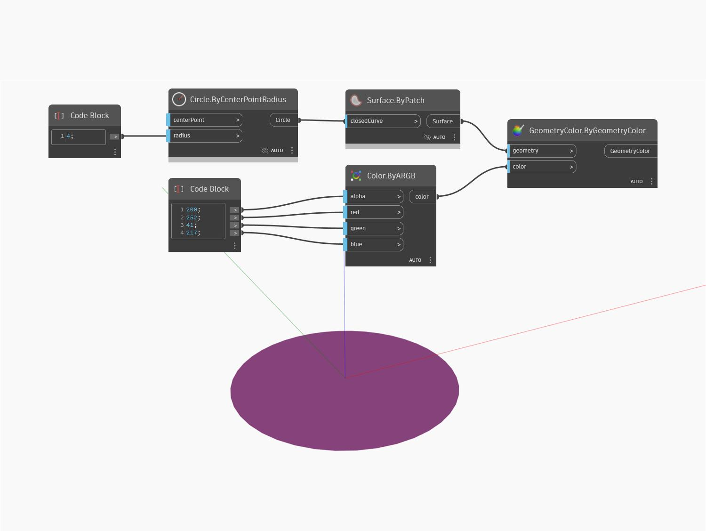

## Informacje szczegółowe
Węzeł ByGeometryColor wyświetla fragment geometrii (geometry) z kolorem wejściowym (color). W poniższym przykładzie wyświetlany jest okrąg z kolorem RGB 227, 136, 200 i wartością alpha równą 200. Jeśli nie jest wyłączony, podgląd geometrii pierwotnej pokryje nową kolorową geometrię.
___
## Plik przykładowy

