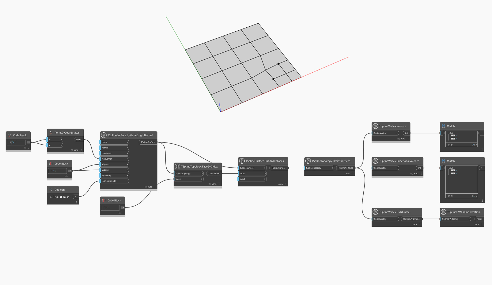

<!--- Autodesk.DesignScript.Geometry.TSpline.TSplineVertex.FunctionalValence --->
<!--- N44VZ3AJYWSL6V3DZOJYGO3ER47KV2Q6UNXWX7N6U47NDLFO3TBQ --->
## In-Depth
Funkcjonalny stopień (valence) wierzchołka to więcej niż prosta liczba przylegających krawędzi — uwzględnia on wirtualne linie siatki, które wpływają na stapianie wierzchołka z otaczającym go obszarem. Ta wartość zapewnia bardziej szczegółowe informacje o wpływie wierzchołków i ich krawędzi na powierzchnię podczas operacji odkształcania i wygładzania.
W przypadku stosowania węzła `TSplineVertex.FunctionalValence` do zwykłych wierzchołków i punktów T zwraca on wartość „4”, co oznacza, że powierzchnia jest prowadzona przez splajny w kształcie siatki. Funkcjonalny stopień (valence) inny niż „4” oznacza, że wierzchołek jest punktem gwiazdowym i stapianie wokół tego wierzchołka będzie mniej gładkie.

W poniższym przykładzie węzeł `TSplineVertex.FunctionalValence` zostaje zastosowany do dwóch wierzchołków w punktach T powierzchni płaszczyzny T-splajn. Węzeł `TSplineVertex.Valence` zwraca wartość 3, podczas gdy funkcjonalny stopień (valence) wybranych wierzchołków ma wartość 4, co jest charakterystyczne dla punktów T. Położenie analizowanych wierzchołków zostaje zwizualizowane za pomocą węzłów `TSplineVertex.UVNFrame` i `TSplineUVNFrame.Position`.

## Plik przykładowy

