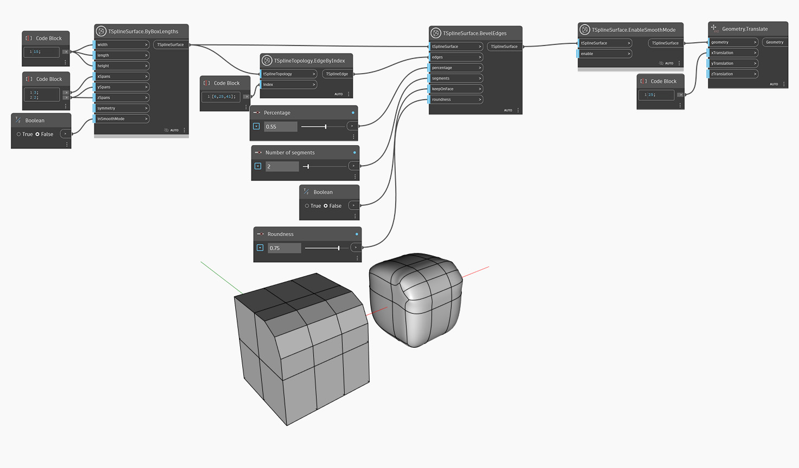

<!--- Autodesk.DesignScript.Geometry.TSpline.TSplineSurface.EnableSmoothMode --->
<!--- NN2ZH7ONXE6AF3LL2XG7BSXNABGZRF4KYTGXDYF24O5PLZ2GWW4Q --->
## Informacje szczegółowe
Tryb ramki i tryb gładki to dwa sposoby wyświetlania powierzchni T-splajn. Tryb gładki pozwala uzyskać rzeczywisty kształt powierzchni T-splajn oraz zapewnia podgląd estetyki i wymiarów modelu. Natomiast tryb ramki pozwala przyjrzeć się strukturze powierzchni i lepiej ją zrozumieć, a ponadto jest szybszym sposobem uzyskania podglądu dużej lub złożonej geometrii. Węzeł `TSplineSurface.EnableSmoothMode` umożliwia przełączanie między tymi dwoma stanami podglądu na różnych etapach tworzenia geometrii.

W poniższym przykładzie na powierzchni prostopadłościanu T-splajn zostaje wykonana operacja tworzenia skosu. Wynik zostaje najpierw zwizualizowany w trybie ramki (pozycja danych wejściowych `inSmoothMode` powierzchni prostopadłościanu ma ustawienie false — fałsz) w celu ułatwienia zrozumienia struktury kształtu. Następnie za pomocą węzła `TSplineSurface.EnableSmoothMode` zostaje aktywowany tryb gładki, a wynik zostaje przekształcony po prawej stronie w celu wyświetlania podglądu w obu trybach jednocześnie.
___
## Plik przykładowy

