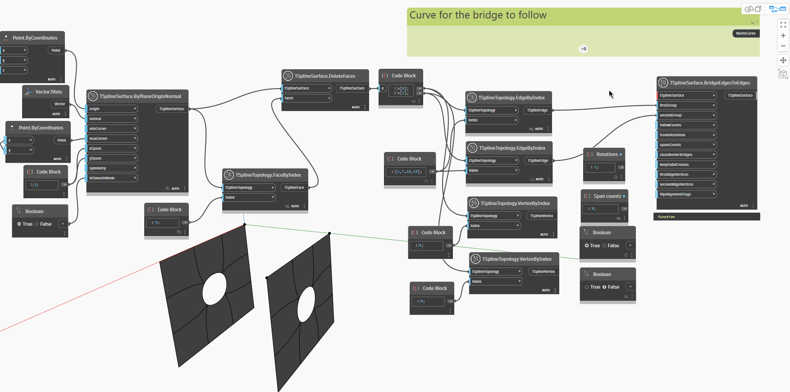

<!--- Autodesk.DesignScript.Geometry.TSpline.TSplineSurface.BridgeEdgesToEdges --->
<!--- NTIOVTTOXGWZ33W6ET5JH4PSYC7L3IFSWCJV4Y3IG3CTARQGOG3A --->
## Informacje szczegółowe
Węzeł `TSplineSurface.BridgeEdgesToEdges` łączy dwa zestawy krawędzi — z tej samej powierzchni lub z dwóch różnych powierzchni. Węzeł wymaga danych wejściowych opisanych poniżej. Pierwsze trzy pozycje danych wejściowych są wystarczające do wygenerowania mostu — pozostałe dane wejściowe są opcjonalne. Wynikowa powierzchnia jest elementem podrzędnym powierzchni, do której należy pierwsza grupa krawędzi.

- `TSplineSurface`: the surface to bridge
- `firstGroup`: Edges from the TSplineSurface selected
— `secondGroup`: krawędzie z tej samej wybranej powierzchni T-splajn lub z innej. Liczba krawędzi musi być zgodna z liczbą krawędzi po drugiej stronie mostu lub być jej wielokrotnością.
- `followCurves`: (optional) a curve for the bridge to follow. In the absence of this input, the bridge follows a straight line
- `frameRotations`: (optional) number of rotations of the bridge extrusion that connects the chosen edges.
- `spansCounts`: (optional) number of spans/segments of the bridge extrusion that connects the chosen edges. If the number of spans is too low, certain options might not be available until it is increased.
- `cleanBorderBridges`:(optional) deletes bridges between border bridges to prevent creases
- `keepSubdCreases`:(optional) preserves the SubD-creases of the input topology, resulting in a creased treatement of the start and end of the bridge
- `firstAlignVertices`(optional) and `secondAlignVertices`: enforce the alignment between two sets of vertices instead of automatically choosing to connect pairs of closest vertices.
- `flipAlignFlags`: (optional) reverses the direction of vertices to align

W poniższym przykładzie zostają utworzone dwie płaszczyzny T-splajn i za pomocą węzła `TSplineSurface.DeleteEdges` zostaje usunięta powierzchnia w centrum każdej z nich. Krawędzie wokół usuniętej powierzchni zostają zebrane za pomocą węzła `TSplineTopology.VertexByIndex`. Aby utworzyć most, dwie grupy krawędzi zostają przekazane jako dane wejściowe do węzła `TSplineSurface.BrideEdgesToEdges` wraz z jedną z powierzchni. Powoduje to utworzenie mostu. Do mostu dodanych zostaje więcej rozpiętości przez edytowanie pozycji danych wejściowych `spansCounts`. Gdy jako wartość wejściowa `followCurves` używana jest krzywa, most podąża za kierunkiem tej krzywej. Pozycje danych `keepSubdCreases`,`frameRotations`, `firstAlignVertices` i `secondAlignVertices` ilustrują, jak można dostosować kształt mostu.

## Plik przykładowy

