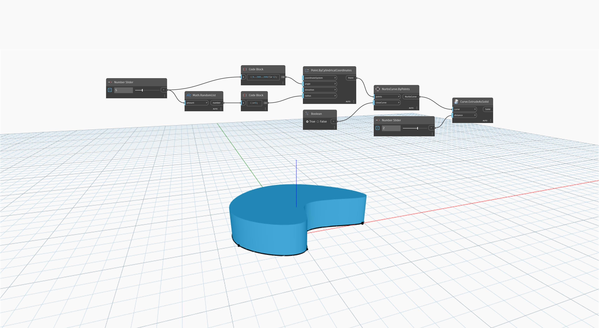

<!--- Autodesk.DesignScript.Geometry.Curve.ExtrudeAsSolid(curve, distance) --->
<!--- NWZ4OHZGJ3DY35YJAGFATFVE4TKRWATQD3KYVPZ6JOGMLBYXOLLA --->
## Informacje szczegółowe
Węzeł `Curve.ExtrudeAsSolid (curve, distance)` wyciąga zamkniętą płaską krzywą wejściową, określając odległość wyciągnięcia za pomocą liczby wejściowej (distance). Kierunek wyciągnięcia jest określany przez wektor normalny płaszczyzny, na której leży krzywa. Ten węzeł zamyka końce wyciągnięcia w celu utworzenia bryły.

W poniższym przykładzie najpierw tworzymy krzywą NurbsCurve za pomocą węzła `NurbsCurve.ByPoints` z danymi wejściowymi w postaci zestawu losowo wygenerowanych punktów. Następnie za pomocą węzła `Curve.ExtrudeAsSolid` wyciągamy krzywą do postaci bryły. Wartość wejściową `distance` węzła `Curve.ExtrudeAsSolid` określamy za pomocą suwaka Number Slider.
___
## Plik przykładowy

