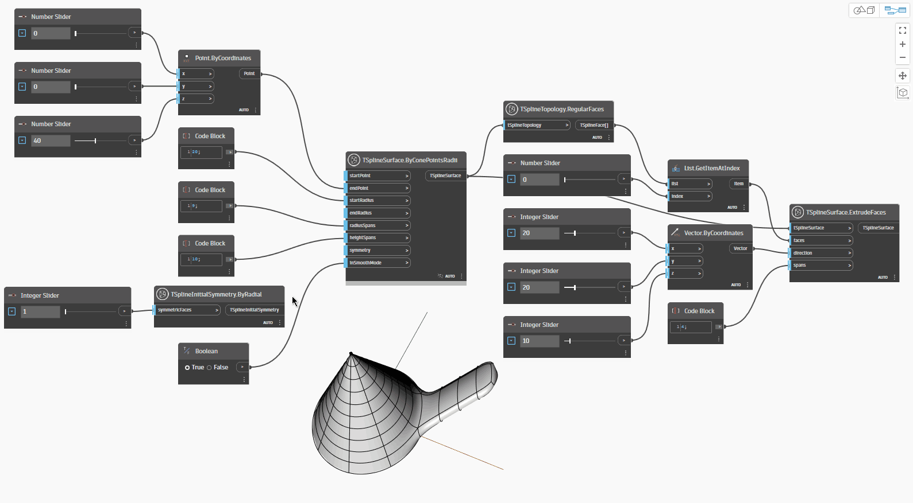

<!--- Autodesk.DesignScript.Geometry.TSpline.TSplineInitialSymmetry.ByRadial --->
<!--- PK6P6YKREOU7DHO6OXJFT6PUF5LSO2W7ZW4IOTGWYPW3BJYASCOQ --->
## In-Depth
Węzeł `TSplineInitialSymmetry.ByRadial` określa, czy geometria T-splajn ma symetrię promieniową. Symetrię promieniową można wprowadzić tylko dla prymitywów T-splajn, które to umożliwiają — dla stożka, sfery, kształtu obrotowego lub torusa. Po jej ustanowieniu przy tworzeniu geometrii T-splajn symetria promieniowa wpływa na wszystkie kolejne operacje i zmiany.

Aby zastosować symetrię, należy zdefiniować żądaną liczbę powierzchni symetrycznych `symmetricFaces`, przy czym minimum wynosi 1. Niezależnie od tego, ile rozpiętości promieniowych i wysokościowych powierzchnia T-splajn ma na początku, zostanie ona dalej podzielona zgodnie z wybraną liczbą `symmetricFaces`.

W poniższym przykładzie zostaje utworzony węzeł `TSplineSurface.ByConePointsRadii` i zostaje zastosowana symetria promieniowa za pomocą węzła `TSplineInitialSymmetry.ByRadial`. Za pomocą węzłów `TSplineTopology.RegularFaces` i `TSplineSurface.ExtrudeFaces` zostaje następnie wybrana i wyciągnięta powierzchnia w powierzchni T-splajn. Wyciągnięcie proste jest stosowane symetrycznie, a suwak dla liczby powierzchni symetrycznych ilustruje, jak rozpiętości promieniowe są dzielone na składowe.

## Plik przykładowy

