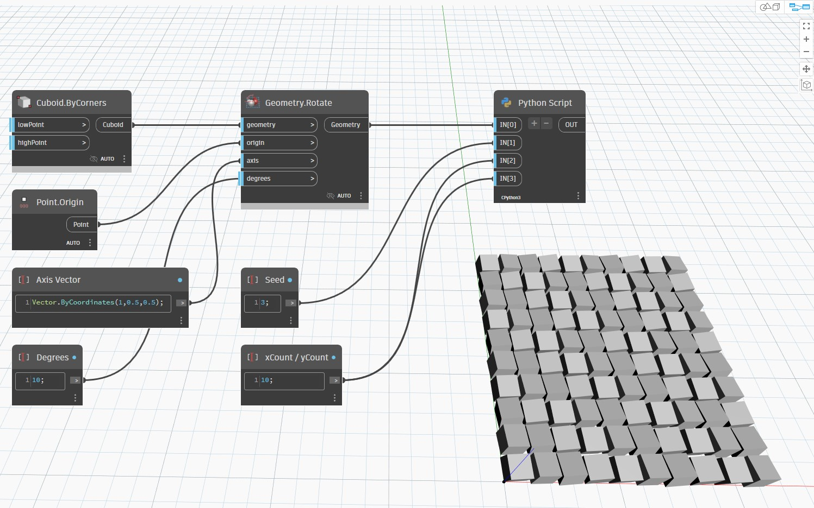

## Informacje szczegółowe
Węzeł Python Script zwraca wynik dla danych wejściowych węzła przetworzonych za pomocą osadzonego skryptu IronPython. W poniższym przykładzie sześcian utworzony za pomocą węzła Cuboid.ByCorners zostaje umieszczony w tablicy i przekształcony przez skrypt w języku Python z pętlami obejmującymi współrzędne X i Y. Kliknięcie dwukrotne węzła spowoduje wyświetlenie edytora skryptu.
___
## Plik przykładowy

