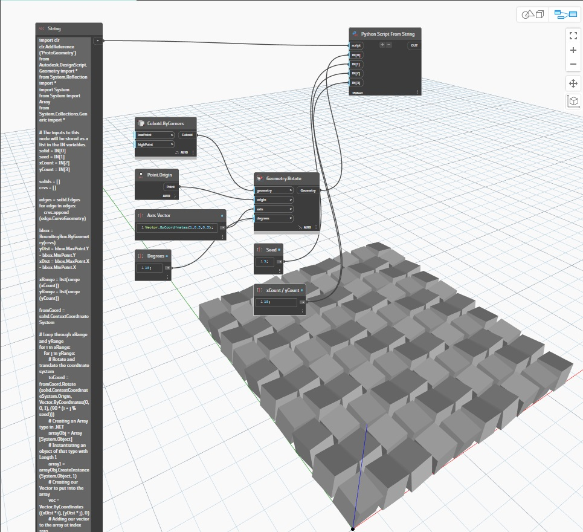

## Informacje szczegółowe
Węzeł Python Script From String zwraca wynik dla danych wejściowych węzła przetworzonych za pomocą skryptu w języku Python. W poniższym przykładzie skrypt w języku Python jest pobierany z węzła ciągu (string). Sześcian utworzony za pomocą węzła Cuboid.ByCorners zostaje umieszczony w tablicy i przekształcony przez skrypt w języku Python za pomocą pętli obejmujących współrzędne X i Y.
___
## Plik przykładowy

