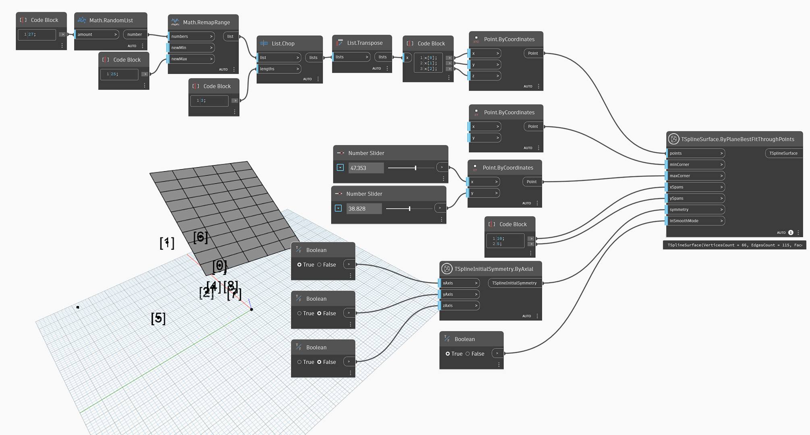

<!--- Autodesk.DesignScript.Geometry.TSpline.TSplineSurface.ByPlaneBestFitThroughPoints --->
<!--- QMBSK3FVRYFQCMSXFIPKLNLYVY5W4C4PNN7IGZUPDZOVWUPWZNZQ --->
## In-Depth
Węzeł `TSplineSurface.ByPlaneBestFitThroughPoints` generuje powierzchnię płaszczyzny prymitywu T-splajn na podstawie listy punktów. Aby utworzyć płaszczyznę T-splajn, węzeł ten używa następujących danych wejściowych:
— `points`: zestaw punktów definiujących orientację i początek płaszczyzny. Jeśli punkty wejściowe nie leżą na pojedynczej płaszczyźnie, orientacja płaszczyzny jest określana na podstawie najlepszego dopasowania. Do utworzenia powierzchni wymagane są co najmniej trzy punkty.
— `minCorner` i `maxCorner`: narożniki płaszczyzny reprezentowane jako punkty o wartościach X i Y (współrzędne Z zostaną zignorowane). Te narożniki reprezentują zakresy wyjściowej powierzchni T-splajn w przypadku przekształcenia jej na płaszczyznę XY. Punkty `minCorner` i `maxCorner` nie muszą pokrywać się z wierzchołkami narożnika w 3D.
- `xSpans` and `ySpans`: number of width and length spans/divisions of the plane
- `symmetry`: whether the geometry is symmetrical with respect to its X, Y and Z axes
- `inSmoothMode`: whether the resulting geometry will appear with smooth or box mode

W poniższym przykładzie zostaje utworzona powierzchnia płaska T-splajn przy użyciu losowo wygenerowanej listy punktów. Rozmiarem powierzchni sterują dwa punkty określane za pomocą danych wejściowych `minCorner` i `maxCorner`.

## Plik przykładowy

