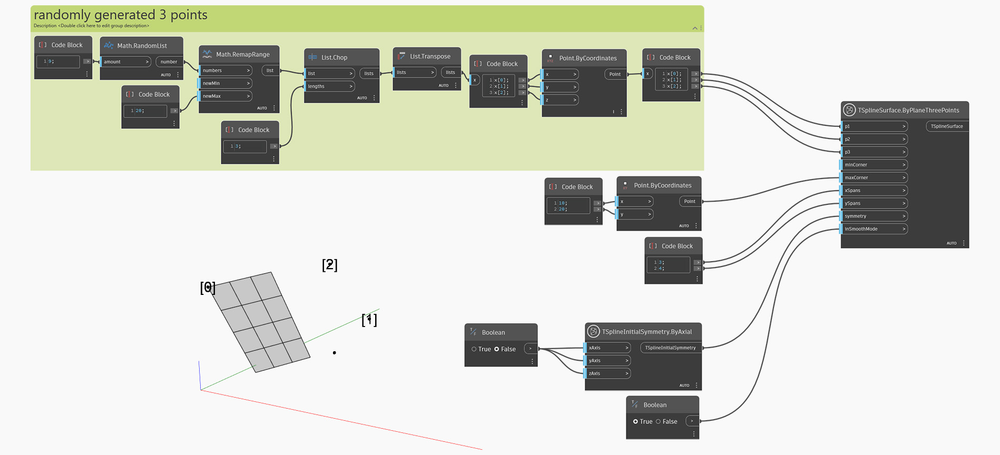

<!--- Autodesk.DesignScript.Geometry.TSpline.TSplineSurface.ByPlaneThreePoints --->
<!--- SFTUBFPMM3AWPUQ6E6XPGTDHXANNIVC3ZHSMIP63ZGMSHIEQMWFQ --->
## In-Depth
Węzeł `TSplineSurface.ByPlaneThreePoints` generuje powierzchnię płaszczyzny prymitywu T-splajn na podstawie trzech punktów jako danych wejściowych. Aby utworzyć płaszczyznę T-splajn, węzeł ten używa następujących danych wejściowych:
— `p1`, `p2` i `p3`: trzy punkty definiujące położenie płaszczyzny. Pierwszy punkt jest traktowany jako początek płaszczyzny.
- `minCorner` and `maxCorner`: the corners of the plane, represented as Points with X and Y values (Z coordinates will be ignored). These corners represent the extents of the output T-Spline surface if it is translated onto the XY plane. The `minCorner` and `maxCorner` points do not have to coincide with the corner vertices in 3D. For example, when a `minCorner` is set to (0,0) and `maxCorner` is (5,10), the plane width and length will be 5 and 10 respectively.
- `xSpans` and `ySpans`: number of width and length spans/divisions of the plane
- `symmetry`: whether the geometry is symmetrical with respect to its X, Y and Z axes
- `inSmoothMode`: whether the resulting geometry will appear with smooth or box mode

W poniższym przykładzie zostaje utworzona powierzchnia płaska T-splajn przy użyciu trzech losowo wygenerowanych punktów. Pierwszy punkt jest początkiem płaszczyzny. Rozmiarem powierzchni sterują dwa punkty określane za pomocą danych wejściowych `minCorner` i `maxCorner`.

## Plik przykładowy

