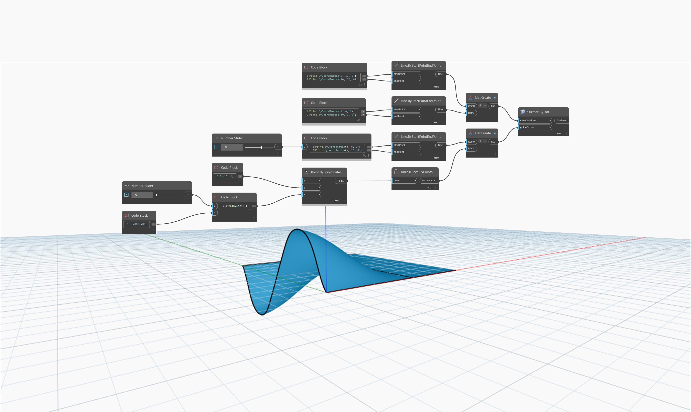

<!--- Autodesk.DesignScript.Geometry.Surface.ByLoft(crossSections, guideCurves) --->
<!--- SINCXSXBHUIGJR3UTLPZRANLRDQTQ7J3YRTX5LDDY2BOYA4F6XYQ --->
## Informacje szczegółowe
Węzeł `Surface.ByLoft (crossSections, guideCurves)` pobiera listę przekrojów poprzecznych, między którymi przebiegnie wyciągnięcie złożone, oraz oddzielną listę krzywych prowadzących określających profil wyciągnięcia złożonego.

W poniższym przykładzie używamy dwóch linii prostych jako wejściowych przekrojów poprzecznych. Jako krzywe prowadzące utworzymy jedną krzywą sinusoidalną i jedną linię prostą. Suwak Number Slider steruje odległością między krzywą sinusoidalną a linią prostą. Wynikowe wyciągnięcie złożone tworzy interpolację między krzywą sinusoidalną a linią prostą.

___
## Plik przykładowy

