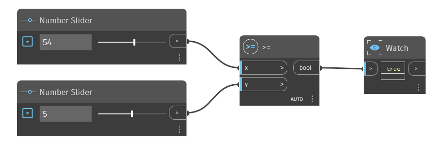

## Informacje szczegółowe
Węzeł `>=` jest operatorem „większe niż lub równe”. Jeśli wartość wejściowa `x` jest większa niż wartość wejściowa `y` lub jeśli wartości te są równe, Istnieje w słowniku 1.x; edytowana nazwa wykresu: GreaterThanOrEqualTo.dyn Y

zwraca wartość True (Prawda). Jeśli wartość `x` jest mniejsza niż `y`, ten operator zwraca wartość False (Fałsz). W poniższym przykładzie węzeł `>=` jest używany do określenia, czy wartość wejściowa `x` jest większa niż wartość wejściowa `y` lub jest jej równa. Używamy dwóch węzłów Number Slider do sterowania wartościami wejściowymi operatora `>=`.
___
## Plik przykładowy

