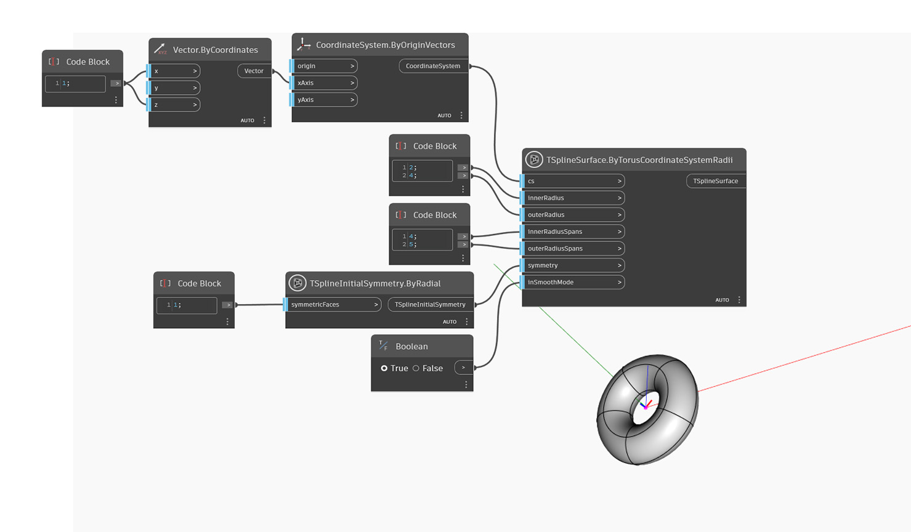

<!--- Autodesk.DesignScript.Geometry.TSpline.TSplineSurface.ByTorusCoordinateSystemRadii --->
<!--- TTAJ2WGGNFLM755ADOCD3G7N4MJBQI66CAC7SXM3XCYLEIPLBOCQ --->
## In-Depth
W poniższym przykładzie zostaje utworzona powierzchnia torusa T-splajn, której początek znajduje się w danym układzie współrzędnych `cs`. Promienie mniejszy i większy kształtu ustawia się za pomocą pozycji danych wejściowych `innerRadius` i `outerRadius`. Wartości pozycji `innerRadiusSpans` i `outerRadiusSpans` sterują definicją powierzchni wzdłuż dwóch kierunków. Symetrię początkową kształtu określa pozycja danych wejściowych `symmetry`. Jeśli symetria osiowa zastosowana do kształtu jest aktywna dla osi X lub Y, wartość pozycji `outerRadiusSpans` torusa musi być wielokrotnością 4. Symetrii promieniowej nie dotyczy takie wymaganie. Wreszcie pozycja danych wejściowych `inSmoothMode` służy do przełączania między podglądem powierzchni T-splajn w trybie gładkim i w trybie ramki.

## Plik przykładowy

