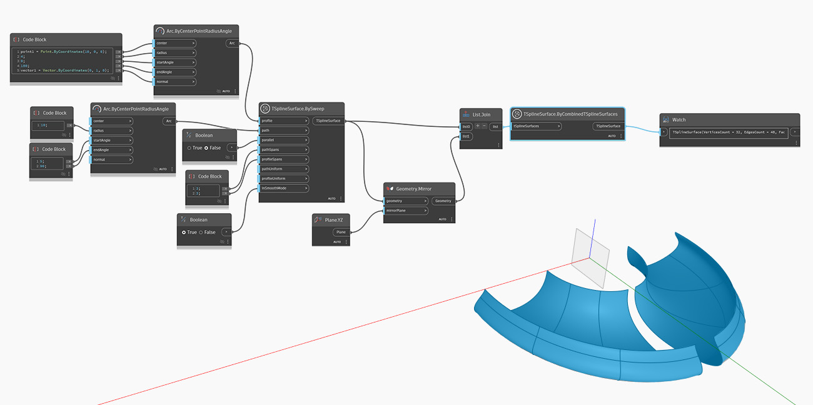

<!--- Autodesk.DesignScript.Geometry.TSpline.TSplineSurface.ByCombinedTSplineSurfaces --->
<!--- U35TWGXYHIE46AYX3QP45IXNCZJAFUT62AN4GKHWSYFDMJWZ2WZQ --->
## Informacje szczegółowe
W poniższym przykładzie zostaje utworzona nowa powierzchnia T-splajn z dwóch powierzchni odbitych wokół osi. Powierzchnie nie muszą się stykać. Dane wyjściowe węzła to pojedyncza powierzchnia T-splajn, nawet jeśli wydaje się, że zawiera ona dwie topologicznie oddzielne części.

## Plik przykładowy

