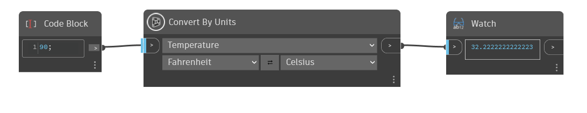

## Informacje szczegółowe
Węzeł `Convert By Units` konwertuje wartość wejściową danej jednostki na odpowiednią jednostkę w innym układzie jednostek. Dostępne opcje zależą od typu jednostki wybranego z pierwszej listy rozwijanej. Użyj przycisku strzałek, aby zamienić jednostki między stronami lewą i prawą.

W tym przykładzie za pomocą węzła `Convert By Units` konwertujemy wartości między stopniami Fahrenheita i stopniami Celsjusza. Z pierwszej listy rozwijanej zostaje wybrana opcja temperatury, co powoduje, że na dwóch niższych listach rozwijanych są wyświetlane tylko opcje związane z temperaturą.
___
## Plik przykładowy

