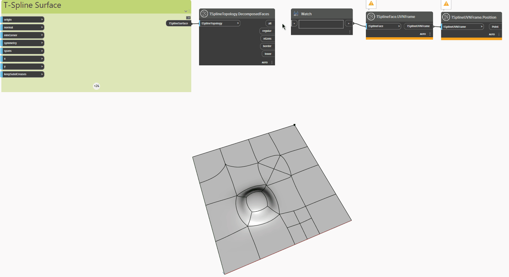

<!--- Autodesk.DesignScript.Geometry.TSpline.TSplineTopology.DecomposedFaces --->
<!--- VIA3XNZWZWW3XHWL222NGHWM22VLSA4QXMZCPWZ6JO6G3P7H2WGA --->
## Informacje szczegółowe
W poniższym przykładzie płaska powierzchnia T-splajn z wyciągniętymi, podzielonymi na składowe i przeciągniętymi wierzchołkami i powierzchniami jest poddawana inspekcji za pomocą węzła `TSplineTopology.DecomposedFaces`, który zwraca listę następujących typów powierzchni zawartych w powierzchni T-splajn:

— `all`: lista wszystkich powierzchni
— `regular`: lista zwykłych powierzchni
— `nGons`: lista powierzchni N-boków
— `border`: lista powierzchni obramowania
— `inner`: lista powierzchni wewnętrznych

Za pomocą węzłów `TSplineFace.UVNFrame` i `TSplineUVNFrame.Position` zostają wyróżnione różne typy powierzchni w danej powierzchni.
___
## Plik przykładowy

