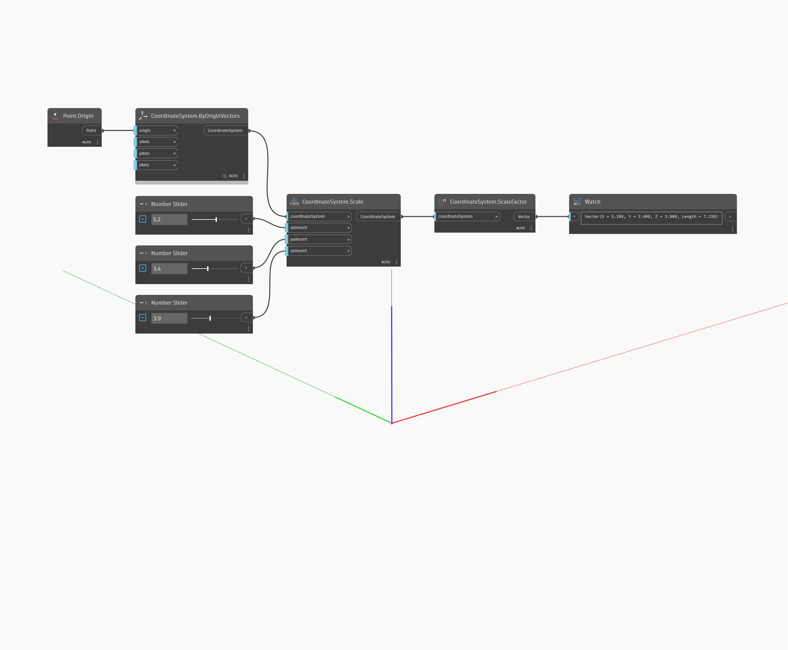

<!--- Autodesk.DesignScript.Geometry.CoordinateSystem.Scale(plane, xamount, yamount, zamount) --->
<!--- VK6GQ42BUN4KBY4KJUYSHBYUP6QQDHLXPGOYWHT6TYV3KTFHSJOQ --->
## Informacje szczegółowe
Skaluj układ współrzędnych nierównomiernie wokół początku na danej płaszczyźnie.
___
## Plik przykładowy

