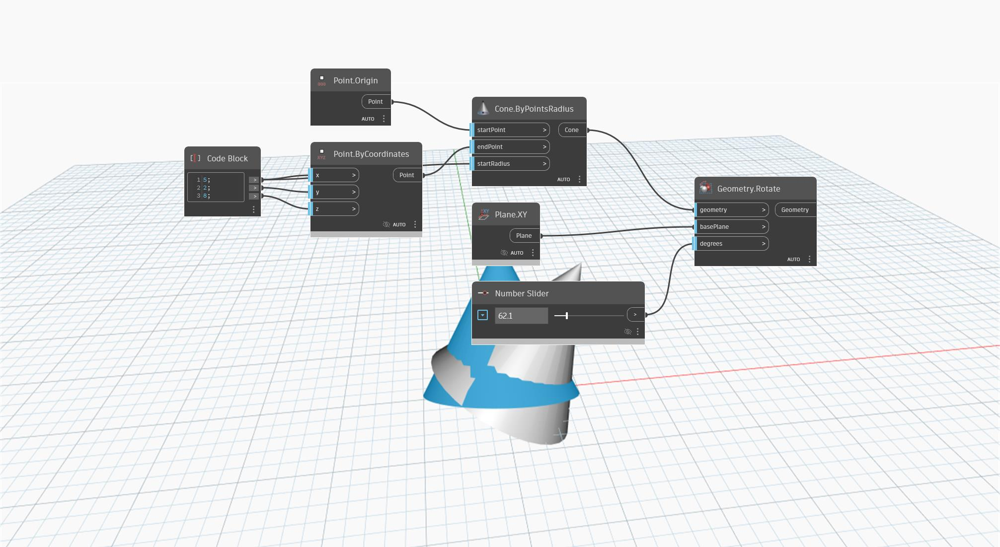

<!--- Autodesk.DesignScript.Geometry.Geometry.Rotate(geometry, basePlane, degrees) --->
<!--- XFRRMCMTIOHR6PV6TSFT3WDOBWKWHFMLXAMO7W5HDBP47YU5C2WQ --->
## Informacje szczegółowe
Węzeł `Geometry.Rotate (basePlane, degrees)` obraca geometrię wejściową wokół punktu początkowego i wektora osi o dany kąt w stopniach (degrees).

W poniższym przykładzie stożek zostaje obrócony wokół wektora osi Y za pomocą jego punktu końcowego.

___
## Plik przykładowy

